## Overview

Pedestrian crossing behaviour varies globally. This study analyses dashcam footage from the CROWD dataset, covering 233 countries and territories, to examine crossing initiation time, crossing speed, and contextual variables, including detected vehicles, traffic mortality, GDP, and Gini coefficient. Qatar had the longest mean crossing initiation time (6.44s), while China exhibited the fastest crossing speed (1.69m/s). On average, worldwide, pedestrians exhibited a crossing initiation time of 3.18s and crossing speed 1.20m/s. Crossing speed and crossing initiation time are negatively correlated (r = -0.18), indicating slower crossings after longer hesitation. Crossing speed is negatively correlated with Gini coefficient (r = -0.19) and positively correlated with traffic mortality (r = 0.18). Similar crossing times in countries with different infrastructures, such as Bangladesh (3.42s) and the Netherlands (3.40s), underscore the complex interaction between infrastructure and behavioural adaptation. These findings emphasise the importance of culturally aware road design and the development of adaptive interfaces for vehicles.

## Usage of the code
The code is open-source and free to use. It is aimed for, but not limited to, academic research. We welcome forking of this repository, pull requests, and any contributions in the spirit of open science and open-source code 😍😄 For inquiries about collaboration, you may contact Md Shadab Alam (md_shadab_alam@outlook.com) or Pavlo Bazilinskyy (pavlo.bazilinskyy@gmail.com).

## Citation
If you use the gans-traffic for academic work please cite the following paper:

> Alam, M. S., Martens, M.H., & Bazilinskyy, P. (2025). Pedestrian Planet: What YouTube Driving from 231 Countries and Territories Teaches Us About the World. 17th International Conference on Automotive User Interfaces and Interactive Vehicular Applications. Brisbane, QLD, Australia. https://doi.org/10.1145/3744333.3747827

## Getting Started
Tested with Python 3.9.19. To setup the environment run these two commands in a parent folder of the downloaded repository (replace `/` with `\` and possibly add `--user` if on Windows:

**Step 1:**

Clone the repository
```command line
git clone https://github.com/bazilinskyy/youtube-national
```

**Step 2:**

Create a new virtual environment
```command line
python -m venv venv
```

**Step 3:**

Activate the virtual environment
```command line
source venv/bin/activate
```

On Windows use
```command line
venv\Scripts\activate
```

**Step 4:**

Install dependencies
```command line
pip install -r requirements.txt
```

**Step 5:**

Ensure you have the required datasets in the data/ directory, including the mapping.csv file.

**Step 6:**

Run the code:
```command line
python3 analysis.py
```

### Configuration of project
Configuration of the project needs to be defined in `config`. Please use the `default.config` file for the required structure of the file. If no custom config file is provided, `default.config` is used. The config file has the following parameters:
- **`data`**: Directory containing data (CSV output from YOLO).
- **`videos`**: Directories containing the videos used to generate the data.
- **`mapping`**: CSV file that contains mapping data for the cities referenced in the data.
- **`prediction_mode`**: Configures YOLO for object detection.
- **`tracking_mode`**: Configures YOLO for object tracking.
- **`always_analyse`**: Always conduct analysis even when pickle files are present (good for testing).
- **`display_frame_tracking`**: Displays the frame tracking during analysis.
- **`save_annotated_img`**: Saves the annotated frames produced by YOLO.
- **`delete_labels`**: Deletes label files from YOLO output.
- **`delete_frames`**: Deletes frames from YOLO output.
- **`delete_youtube_video`**: Deletes saved YouTube videos.
- **`compress_youtube_video`**: Compresses YouTube videos (using the H.255 codec by default).
- **`delete_runs_files`**: Deletes files containing YOLO output after analysis.
- **`monitor_temp`**: Monitors the temperature of the device running the analysis.
- **`check_missing_mapping`**: Identifies all the missing csv files.
- **`client`**: Specifies the client type for downloading YouTube videos; accepted values are `"WEB"`, `"ANDROID"` or `"ios"`.
- **`model`**: Specifies the YOLO model to use; supported/tested versions include `v8x` and `v11x`.
- **`countries_analyse`**: Lists the countries to be analysed.
- **`confidence`**: Sets the confidence threshold parameter for YOLO.
- **`update_ISO_code`**: Updates the ISO code of the country in the mapping file during analysis.
- **`update_pop_country`**: Updates the country’s population in the mapping file during analysis.
- **`update_continent`**: Updates the continent information in the mapping file during analysis.
- **`update_mortality_rate`**: Updates the mortality rate of the country in the mapping file during analysis.
- **`update_gini_value`**: Updates the GINI value of the country in the mapping file during analysis.
- **`update_upload_date`**: Updates the upload date of videos in the mapping file during analysis.
- **`update_fps_list`**: Updates the FPS (frames per second) information for videos in the mapping file during analysis.
- **`update_pytubefix`**: Updates the `pytubefix` library each time analysis starts.
- **`font_family`**: Specifies the font family to be used in outputs.
- **`font_size`**: Specifies the font size to be used in outputs.
- **`plotly_template`**: Defines the template for Plotly figures.
- **`logger_level`**: Level of console output. Can be: debug, info, warning, error.
- **`sleep_sec`**: Amount of seconds of pause between going over the mapping files.

## Description and analysis of dataset
### Description of dataset
[](https://htmlpreview.github.io/?https://github.com/bazilinskyy/youtube-national/blob/main/figures/raw_map.html)
The 233 countries with dashcam footage included in analysis on the political map (coloured by continent). Black dots show the cities included.

[](https://htmlpreview.github.io/?https://github.com/bazilinskyy/youtube-national/blob/main/figures/hist_speed.html)  
Histogram of pedestrian crossing speeds (in m/s), computed **per individual pedestrian** and pooled across all locations/countries (i.e., not aggregated by city or country).

[](https://htmlpreview.github.io/?https://github.com/bazilinskyy/youtube-national/blob/main/figures/hist_time.html)  
Histogram of pedestrian crossing initiation time (in s), computed **per individual pedestrian** and pooled across all locations/countries (i.e., not aggregated by city or country).


### Dataset after filtering
The dataset undergoes a filtering process to ensure quality and sufficient coverage before being used in analysis. The following thresholds are applied:

- **`footage_threshold`: `1800`**  
  A city is included **only** if it has more than **1800 seconds** (30 minutes) of recorded footage.  
  This ensures each city has a substantial amount of data for reliable insights.

- **`min_crossing_detect`: `100`**  
  A country is included **only** if at least **100 pedestrian crossings** are detected within its boundaries.  
  This ensures that pedestrian-related statistics are meaningful at the country level.

[](https://htmlpreview.github.io/?https://github.com/bazilinskyy/youtube-national/blob/main/figures/hist_speed_filtered.html)  
Histogram of pedestrian crossing speeds (in m/s), computed **per individual pedestrian** and pooled across all locations/countries (i.e., not aggregated by city or country).

[](https://htmlpreview.github.io/?https://github.com/bazilinskyy/youtube-national/blob/main/figures/hist_speed_filtered.html)  
Histogram of pedestrian crossing initiation time (in s), computed **per individual pedestrian** and pooled across all locations/countries (i.e., not aggregated by city or country).

[](https://htmlpreview.github.io/?https://github.com/bazilinskyy/youtube-national/blob/main/figures/mapbox_map.html)

[](https://htmlpreview.github.io/?https://github.com/bazilinskyy/youtube-national/blob/main/figures/mapbox_map_time.html)

### Time to start crossing
[](https://htmlpreview.github.io/?https://github.com/bazilinskyy/youtube-national/blob/main/figures/time_crossing_alphabetical.html)
Mean time to start crossing (in s, sorted by countries).

[](https://htmlpreview.github.io/?https://github.com/bazilinskyy/youtube-national/blob/main/figures/time_crossing_avg.html)
Mean time to start crossing (in s, sorted by average of day and night).

[](https://htmlpreview.github.io/?https://github.com/bazilinskyy/youtube-national/blob/main/figures/map_time_crossing_avg.html)
Map with heatmap based on time to start crossing (in s, sorted by average of day and night).

[](https://htmlpreview.github.io/?https://github.com/bazilinskyy/youtube-national/blob/main/figures/time_crossing_avg_day.html)
Mean time to start crossing during daytime (in s).

[](https://htmlpreview.github.io/?https://github.com/bazilinskyy/youtube-national/blob/main/figures/time_crossing_avg_night.html)
Mean time to start crossing during night time (in s).

### Speed of crossing
[](https://htmlpreview.github.io/?https://github.com/bazilinskyy/youtube-national/blob/main/figures/crossing_speed_alphabetical.html)
Mean speed of crossing (in m/s, sorted by countries).

[](https://htmlpreview.github.io/?https://github.com/bazilinskyy/youtube-national/blob/main/figures/crossing_speed_avg.html)
Mean speed of crossing (in m/s, sorted by average of day and night).

[](https://htmlpreview.github.io/?https://github.com/bazilinskyy/youtube-national/blob/main/figures/map_speed_crossing_avg.html)
Map with heatmap based on mean speed of crossing (in m/s, sorted by average of day and night).

[](https://htmlpreview.github.io/?https://github.com/bazilinskyy/youtube-national/blob/main/figures/crossing_speed_avg_day.html)
Mean speed of crossing during daytime (in m/s).

[](https://htmlpreview.github.io/?https://github.com/bazilinskyy/youtube-national/blob/main/figures/crossing_speed_avg_night.html)
Mean speed of crossing during night time (in m/s).

### Relationship between computed and statistical metrics
[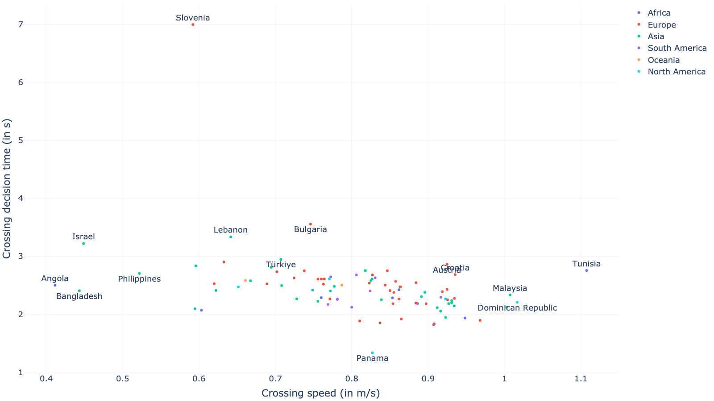](https://htmlpreview.github.io/?https://github.com/bazilinskyy/youtube-national/blob/main/figures/scatter_speed_crossing_avg-time_crossing_avg.html)
Mean speed of crossing (in m/s) over Mean time to start crossing (in s).

[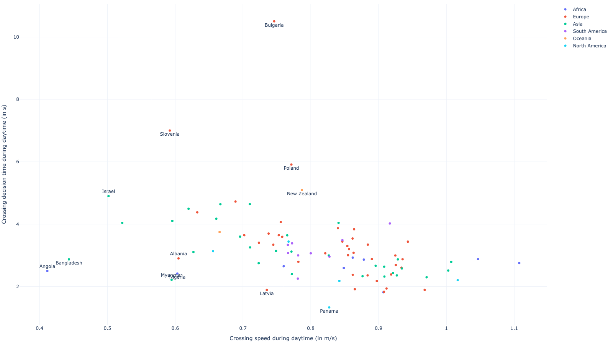](https://htmlpreview.github.io/?https://github.com/bazilinskyy/youtube-national/blob/main/figures/scatter_speed_crossing_day-time_crossing_day.html)
Mean speed of crossing (in m/s) over Mean time to start crossing (in s), during daytime.

[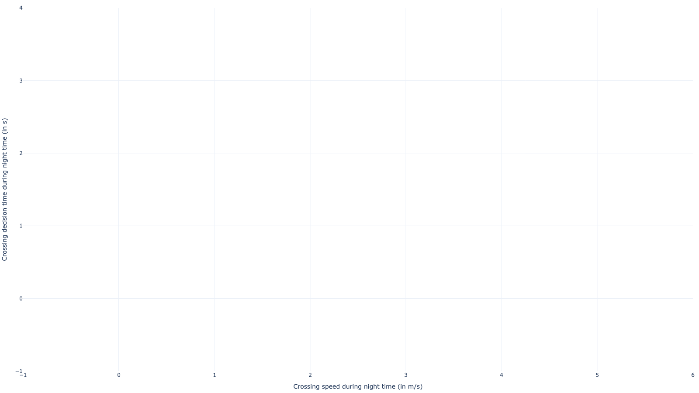](https://htmlpreview.github.io/?https://github.com/bazilinskyy/youtube-national/blob/main/figures/scatter_speed_crossing_night-time_crossing_night.html)
Mean speed of crossing (in m/s) over Mean time to start crossing (in s), during night time.

[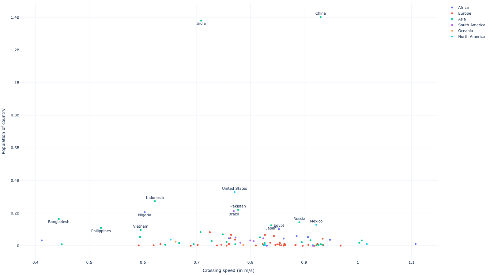](https://htmlpreview.github.io/?https://github.com/bazilinskyy/youtube-national/blob/main/figures/scatter_speed_crossing_avg-population_country.html)
Mean speed of crossing over population of country.

[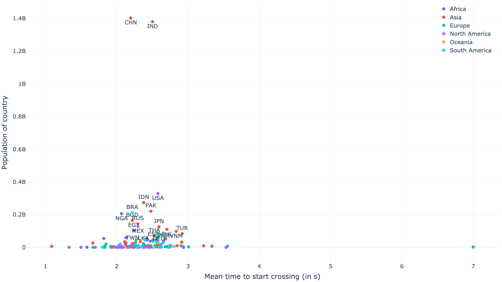](https://htmlpreview.github.io/?https://github.com/bazilinskyy/youtube-national/blob/main/figures/scatter_time_crossing_avg-population_country.html)
Mean time to start crossing over population of country.

[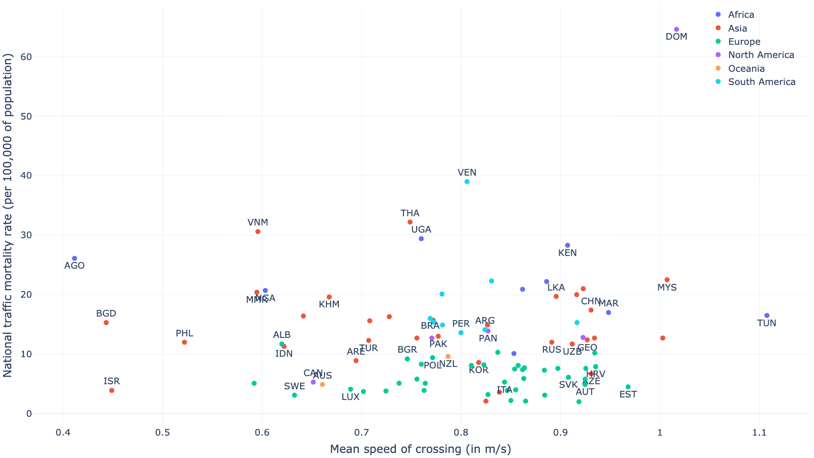](https://htmlpreview.github.io/?https://github.com/bazilinskyy/youtube-national/blob/main/figures/scatter_speed_crossing_avg-traffic_mortality.html)
Mean speed of crossing over traffic mortality.

[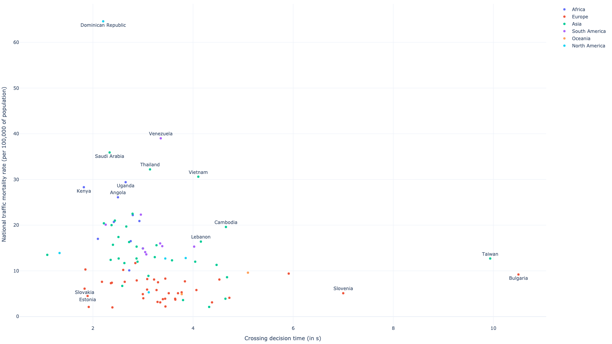](https://htmlpreview.github.io/?https://github.com/bazilinskyy/youtube-national/blob/main/figures/scatter_time_crossing_avg-traffic_mortality.html)
Mean time to start crossing over traffic mortality.

[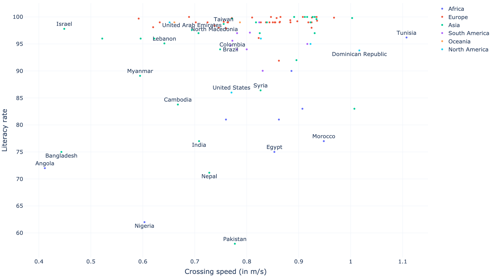](https://htmlpreview.github.io/?https://github.com/bazilinskyy/youtube-national/blob/main/figures/scatter_speed_crossing_avg-literacy_rate.html)
Mean speed of crossing over literacy rate.

[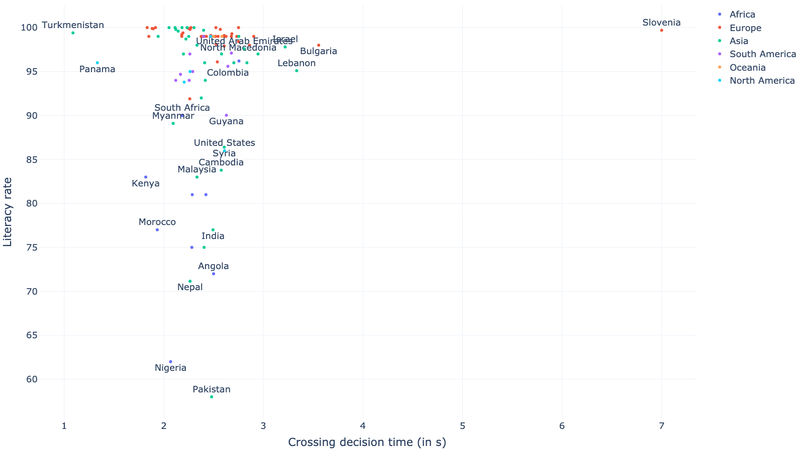](https://htmlpreview.github.io/?https://github.com/bazilinskyy/youtube-national/blob/main/figures/scatter_time_crossing_avg-literacy_rate.html)
Mean time to start crossing over literacy rate.

[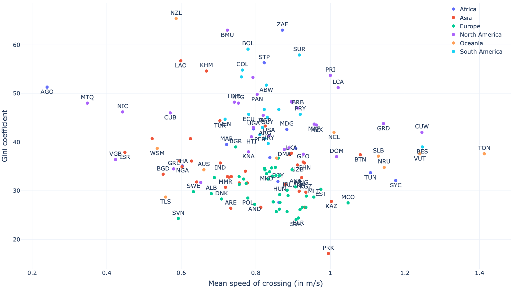](https://htmlpreview.github.io/?https://github.com/bazilinskyy/youtube-national/blob/main/figures/scatter_speed_crossing_avg-gini.html)
Mean speed of crossing over Gini coefficient.

[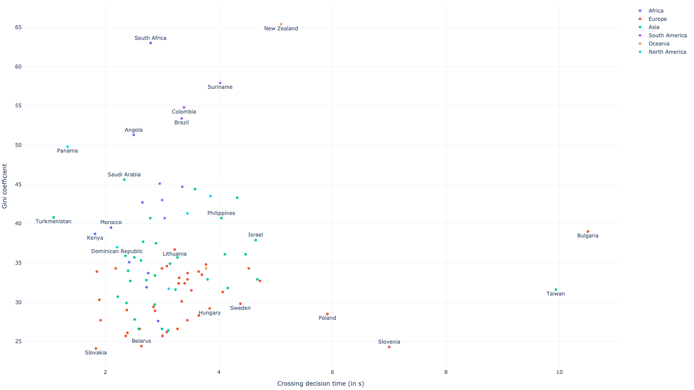](https://htmlpreview.github.io/?https://github.com/bazilinskyy/youtube-national/blob/main/figures/scatter_time_crossing_avg-gini.html)
Mean time to start crossing over Gini coefficient.

[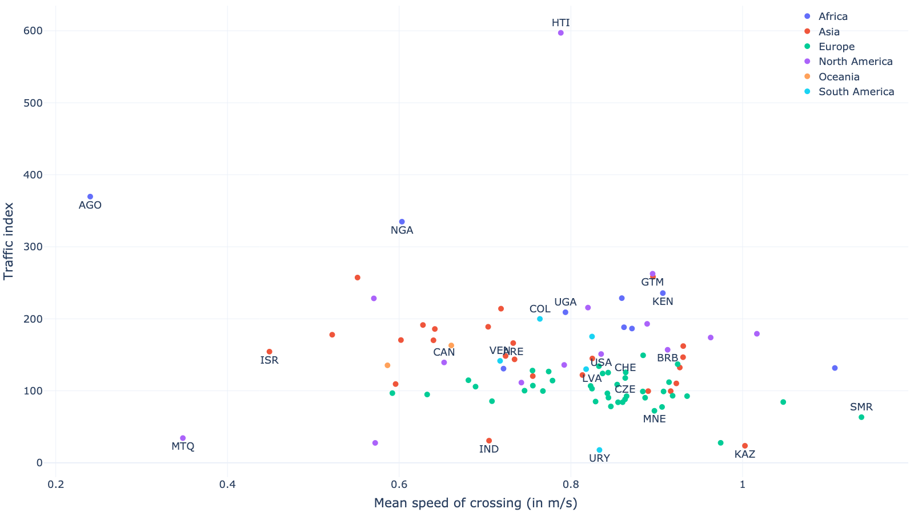](https://htmlpreview.github.io/?https://github.com/bazilinskyy/youtube-national/blob/main/figures/scatter_speed_crossing_avg-traffic_index.html)
Mean speed of crossing over traffic index.

[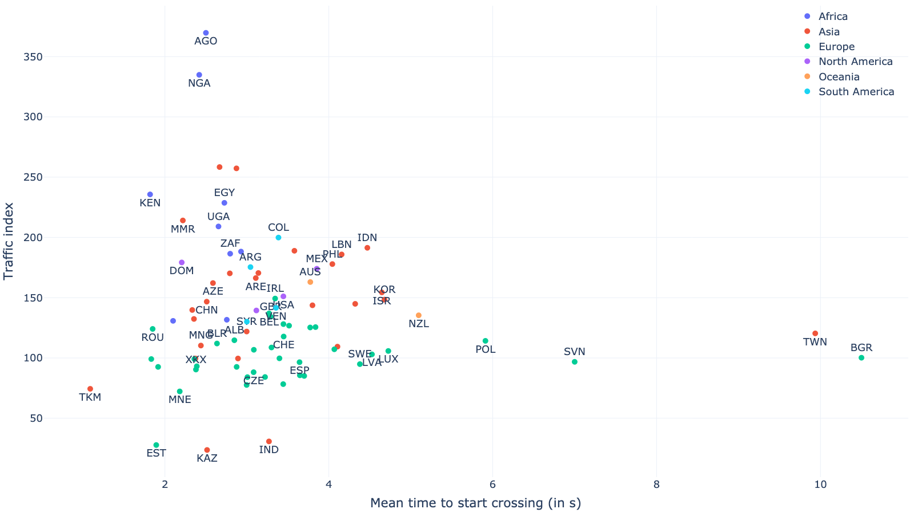](https://htmlpreview.github.io/?https://github.com/bazilinskyy/youtube-national/blob/main/figures/scatter_time_crossing_avg-traffic_index.html)
Mean time to start crossing over traffic index.

[](https://htmlpreview.github.io/?https://github.com/bazilinskyy/youtube-national/blob/main/figures/scatter_time_crossing_avg-traffic_index.html)
Mean time to start crossing over traffic index.

### Correlation matrices
[](https://htmlpreview.github.io/?https://github.com/bazilinskyy/youtube-national/blob/main/figures/correlation_matrix_heatmap_averaged.html)
Correlation matrix.

[](https://htmlpreview.github.io/?https://github.com/bazilinskyy/youtube-national/blob/main/figures/correlation_matrix_heatmap_day.html)
Correlation matrix at daytime.

[](https://htmlpreview.github.io/?https://github.com/bazilinskyy/youtube-national/blob/main/figures/correlation_matrix_heatmap_night.html)
Correlation matrix at night time.

[](https://htmlpreview.github.io/?https://github.com/bazilinskyy/youtube-national/blob/main/figures/correlation_matrix_heatmap_Africa.html)
Correlation matrix for Africa.

[](https://htmlpreview.github.io/?https://github.com/bazilinskyy/youtube-national/blob/main/figures/correlation_matrix_heatmap_Asia.html)
Correlation matrix for Asia.

[](https://htmlpreview.github.io/?https://github.com/bazilinskyy/youtube-national/blob/main/figures/correlation_matrix_heatmap_Oceania.html)
Correlation matrix for Oceania.

[](https://htmlpreview.github.io/?https://github.com/bazilinskyy/youtube-national/blob/main/figures/correlation_matrix_heatmap_Europe.html)
Correlation matrix for Europe.

[](https://htmlpreview.github.io/?https://github.com/bazilinskyy/youtube-national/blob/main/figures/correlation_matrix_heatmap_North%20America.html)
Correlation matrix for North America.

[](https://htmlpreview.github.io/?https://github.com/bazilinskyy/youtube-national/blob/main/figures/correlation_matrix_heatmap_South%20America.html)
Correlation matrix for South America.

### Analysis of pedestrian crossing road with and without traffic lights (jaywalking)
[](https://htmlpreview.github.io/?https://github.com/bazilinskyy/youtube-national/blob/main/figures/crossings_with_traffic_equipment_avg.html)
Road crossings with traffic signals (normalised over time and number of detected pedestrians).

[](https://htmlpreview.github.io/?https://github.com/bazilinskyy/youtube-national/blob/main/figures/crossings_without_traffic_equipment_avg.html)
Road crossings without traffic signals (normalised over time and number of detected pedestrians).

[](https://htmlpreview.github.io/?https://github.com/bazilinskyy/youtube-national/blob/main/figures/scatter_with_trf_light_norm-without_trf_light_norm.html)
Road crossings with and without traffic signals (normalised over time and number of detected pedestrians).

## License
This project is licensed under the MIT License - see the LICENSE file for details.

## Contact
If you have any questions or suggestions, feel free to reach out to md_shadab_alam@outlook.com.
