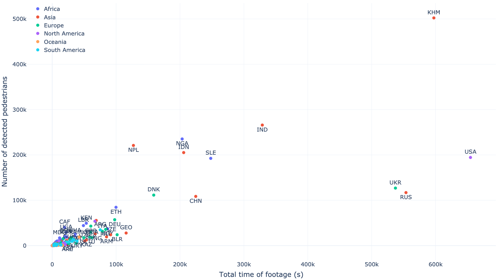
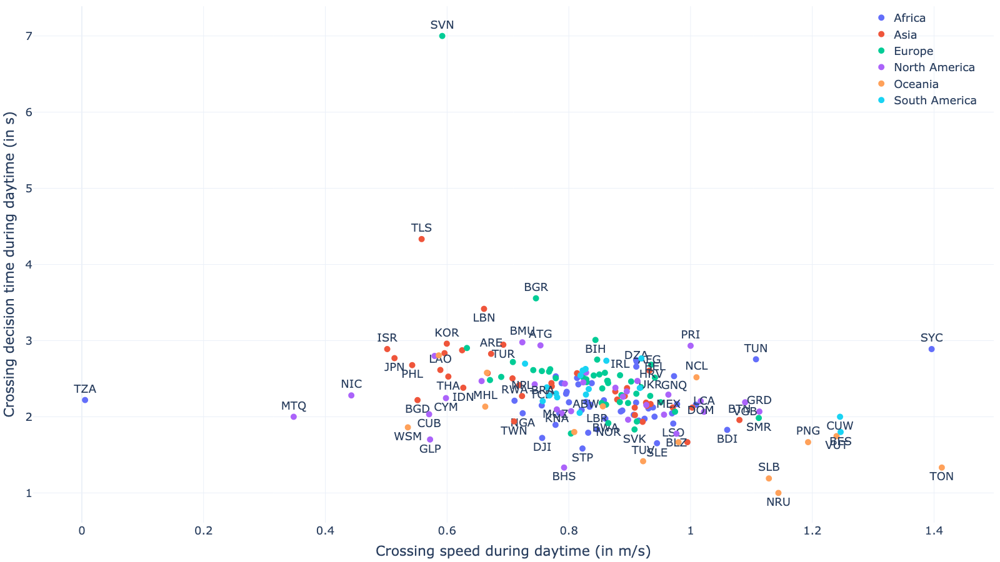
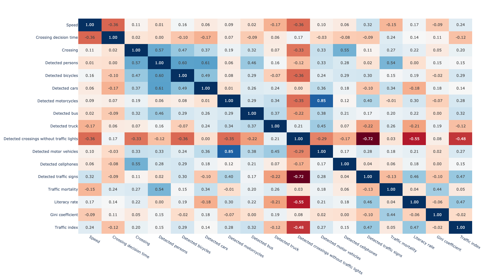
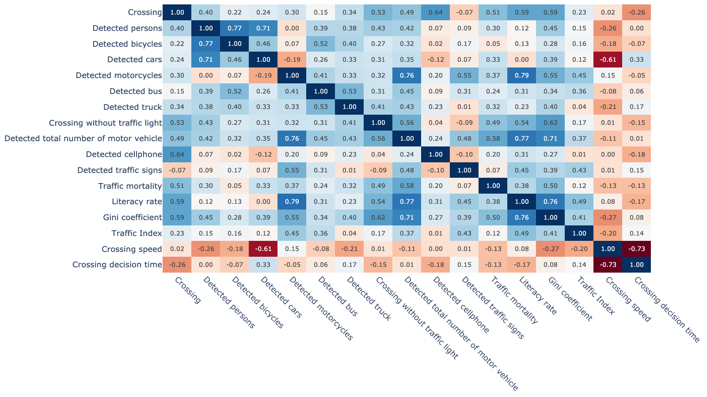

# youtube-country

## Overview

## Usage of the code
The code is open-source and free to use. It is aimed for, but not limited to, academic research. We welcome forking of this repository, pull requests, and any contributions in the spirit of open science and open-source code 😍😄 For inquiries about collaboration, you may contact Md Shadab Alam (md_shadab_alam@outlook.com) or Pavlo Bazilinskyy (pavlo.bazilinskyy@gmail.com).

## Getting Started
Tested with Python 3.9.19. To setup the environment run these two commands in a parent folder of the downloaded repository (replace `/` with `\` and possibly add `--user` if on Windows:

**Step 1:**

Clone the repository
```command line
git clone https://github.com/bazilinskyy/youtube-dashcam
```

**Step 2:**

Create a new virtual environment
```command line
python -m venv venv
```

**Step 3:**

Activate the virtual environment
```command line
source venv/bin/activate
```

On Windows use
```command line
venv\Scripts\activate
```

**Step 4:**

Install dependencies
```command line
pip install -r requirements.txt
```

**Step 5:**

Ensure you have the required datasets in the data/ directory, including the mapping.csv file.

**Step 6:**

Run the code:
```command line
python3 analysis.py
```

## Description and analysis of dataset
### Description of dataset
<!-- [](https://htmlpreview.github.io/?https://github.com/bazilinskyy/youtube-national/blob/main/figures/world_map.html)
Locations of cities with footage in dataset. -->

[](https://htmlpreview.github.io/?https://github.com/bazilinskyy/youtube-national/blob/main/figures/mapbox_map.html)
Locations of cities with footage in dataset. *Note:* continents are based on geography, i.e., the cities in Russia east from Ural mountains are shown as Asia.

<!-- [](https://htmlpreview.github.io/?https://github.com/bazilinskyy/youtube-national/blob/main/figures/consolidated.html)
Crossing decision time and crossing speed (sorted by countries). -->

[](https://htmlpreview.github.io/?https://github.com/bazilinskyy/youtube-national/blob/main/figures/scatter_total_time-person.html)
Total time of footage over number of detected pedestrians.

### Global behaviour of pedestrians
[](https://htmlpreview.github.io/?https://github.com/bazilinskyy/youtube-national/blob/main/figures/time_crossing_alphabetical.html)
Crossing decision time (sorted by countries).

[](https://htmlpreview.github.io/?https://github.com/bazilinskyy/youtube-national/blob/main/figures/crossing_speed_alphabetical.html)
Crossing speed (sorted by countries).

[](https://htmlpreview.github.io/?https://github.com/bazilinskyy/youtube-national/blob/main/figures/time_crossing_avg.html)
Crossing decision time (sorted by average of day and night).

[](https://htmlpreview.github.io/?https://github.com/bazilinskyy/youtube-national/blob/main/figures/crossing_speed_avg.html)
Crossing speed (sorted by average of day and night).

### Relationship between computed and statistical metrics
[](https://htmlpreview.github.io/?https://github.com/bazilinskyy/youtube-national/blob/main/figures/scatter_speed_crossing-time_crossing.html)
Crossing speed over crossing decision time.

[](https://htmlpreview.github.io/?https://github.com/bazilinskyy/youtube-national/blob/main/figures/scatter_speed_crossing_day-time_crossing_day.html)
Crossing speed over crossing decision time, during daytime.

[](https://htmlpreview.github.io/?https://github.com/bazilinskyy/youtube-national/blob/main/figures/scatter_speed_crossing_night-time_crossing_night.html)
Crossing speed over crossing decision time, during night time.

[](https://htmlpreview.github.io/?https://github.com/bazilinskyy/youtube-national/blob/main/figures/scatter_speed_crossing-population_country.html)
Crossing speed over population of country.

[](https://htmlpreview.github.io/?https://github.com/bazilinskyy/youtube-national/blob/main/figures/scatter_time_crossing-population_country.html)
Crossing decision time over population of country.

[](https://htmlpreview.github.io/?https://github.com/bazilinskyy/youtube-national/blob/main/figures/scatter_speed_crossing-traffic_mortality.html)
Crossing speed over traffic mortality.

[](https://htmlpreview.github.io/?https://github.com/bazilinskyy/youtube-national/blob/main/figures/scatter_time_crossing-traffic_mortality.html)
Crossing decision time over traffic mortality.

[](https://htmlpreview.github.io/?https://github.com/bazilinskyy/youtube-national/blob/main/figures/scatter_speed_crossing-literacy_rate.html)
Crossing speed over literacy rate.

[](https://htmlpreview.github.io/?https://github.com/bazilinskyy/youtube-national/blob/main/figures/scatter_time_crossing-literacy_rate.html)
Crossing decision time over literacy rate.

[](https://htmlpreview.github.io/?https://github.com/bazilinskyy/youtube-national/blob/main/figures/scatter_speed_crossing-gini.html)
Crossing speed over Gini coefficient.

[](https://htmlpreview.github.io/?https://github.com/bazilinskyy/youtube-national/blob/main/figures/scatter_time_crossing-gini.html)
Crossing decision time over Gini coefficient.

[](https://htmlpreview.github.io/?https://github.com/bazilinskyy/youtube-national/blob/main/figures/scatter_speed_crossing-traffic_index.html)
Crossing speed over traffic index.

[](https://htmlpreview.github.io/?https://github.com/bazilinskyy/youtube-national/blob/main/figures/scatter_time_crossing-traffic_index.html)
Crossing decision time over traffic index.

[](https://htmlpreview.github.io/?https://github.com/bazilinskyy/youtube-national/blob/main/figures/scatter_time_crossing-traffic_index.html)
Crossing decision time over traffic index.

### Correlation matrices
[](https://htmlpreview.github.io/?https://github.com/bazilinskyy/youtube-national/blob/main/figures/correlation_matrix_heatmap_averaged.html)
Correlation matrix.

[](https://htmlpreview.github.io/?https://github.com/bazilinskyy/youtube-national/blob/main/figures/correlation_matrix_heatmap_day.html)
Correlation matrix at daytime.

[](https://htmlpreview.github.io/?https://github.com/bazilinskyy/youtube-national/blob/main/figures/correlation_matrix_heatmap_night.html)
Correlation matrix at night time.

[](https://htmlpreview.github.io/?https://github.com/bazilinskyy/youtube-national/blob/main/figures/correlation_matrix_heatmap_Africa.html)
Correlation matrix for Africa.

[](https://htmlpreview.github.io/?https://github.com/bazilinskyy/youtube-national/blob/main/figures/correlation_matrix_heatmap_Asia.html)
Correlation matrix for Asia.

[](https://htmlpreview.github.io/?https://github.com/bazilinskyy/youtube-national/blob/main/figures/correlation_matrix_heatmap_Oceania.html)
Correlation matrix for Oceania.

[](https://htmlpreview.github.io/?https://github.com/bazilinskyy/youtube-national/blob/main/figures/correlation_matrix_heatmap_Europe.html)
Correlation matrix for Europe.

[](https://htmlpreview.github.io/?https://github.com/bazilinskyy/youtube-national/blob/main/figures/correlation_matrix_heatmap_North%20America.html)
Correlation matrix for North America.

[](https://htmlpreview.github.io/?https://github.com/bazilinskyy/youtube-national/blob/main/figures/correlation_matrix_heatmap_South%20America.html)
Correlation matrix for South America.

### Analysis of pedestrian crossing road with and without traffic lights (jaywalking)
[](https://htmlpreview.github.io/?https://github.com/bazilinskyy/youtube-national/blob/main/figures/crossings_with_traffic_equipment_avg.html)
Road crossings with traffic signals (normalised over time and number of detected pedestrians).

[](https://htmlpreview.github.io/?https://github.com/bazilinskyy/youtube-national/blob/main/figures/crossings_without_traffic_equipment_avg.html)
Road crossings without traffic signals (normalised over time and number of detected pedestrians).

[](https://htmlpreview.github.io/?https://github.com/bazilinskyy/youtube-national/blob/main/figures/scatter_with_trf_light_norm-without_trf_light_norm.html)
Road crossings with and without traffic signals (normalised over time and number of detected pedestrians).


## License
This project is licensed under the MIT License - see the LICENSE file for details.

## Contact
If you have any questions or suggestions, feel free to reach out to md_shadab_alam@outlook.com
