## Overview

## Usage of the code
The code is open-source and free to use. It is aimed for, but not limited to, academic research. We welcome forking of this repository, pull requests, and any contributions in the spirit of open science and open-source code 😍😄 For inquiries about collaboration, you may contact Md Shadab Alam (md_shadab_alam@outlook.com) or Pavlo Bazilinskyy (pavlo.bazilinskyy@gmail.com).

## Getting Started
Tested with Python 3.9.19. To setup the environment run these two commands in a parent folder of the downloaded repository (replace `/` with `\` and possibly add `--user` if on Windows:

**Step 1:**

Clone the repository
```command line
git clone https://github.com/bazilinskyy/youtube-dashcam
```

**Step 2:**

Create a new virtual environment
```command line
python -m venv venv
```

**Step 3:**

Activate the virtual environment
```command line
source venv/bin/activate
```

On Windows use
```command line
venv\Scripts\activate
```

**Step 4:**

Install dependencies
```command line
pip install -r requirements.txt
```

**Step 5:**

Ensure you have the required datasets in the data/ directory, including the mapping.csv file.

**Step 6:**

Run the code:
```command line
python3 analysis.py
```

## Description and analysis of dataset
### Description of dataset
<!-- [](https://htmlpreview.github.io/?https://github.com/bazilinskyy/youtube-national/blob/main/figures/world_map.html)
Locations of cities with footage in dataset. -->

[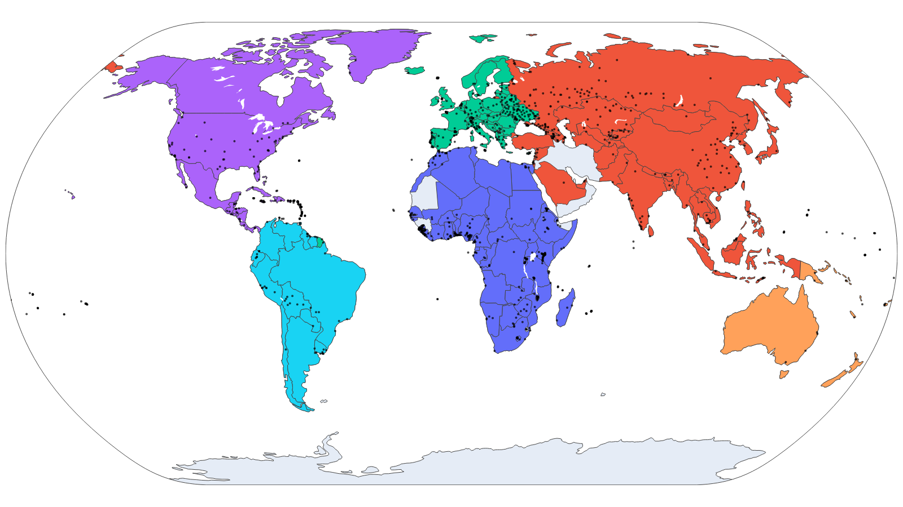](https://htmlpreview.github.io/?https://github.com/bazilinskyy/youtube-national/blob/main/figures/map.html)
The 133 countries with dashcam footage included in analysis on the political map (coloured by continent). Black dots show the cities included.

<!-- [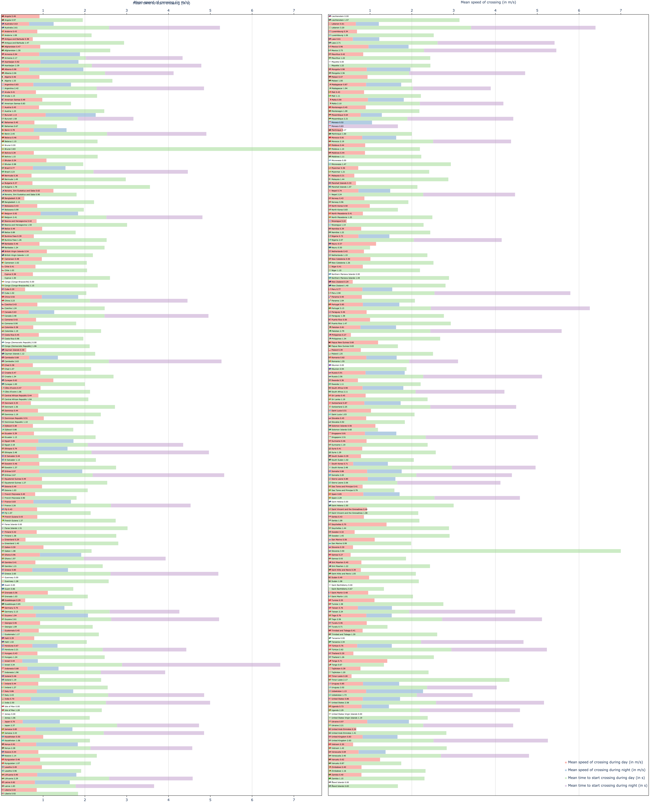](https://htmlpreview.github.io/?https://github.com/bazilinskyy/youtube-national/blob/main/figures/consolidated.html)
Mean time to start crossing and Mean speed of crossing (in m/s, sorted by countries). -->

[](https://htmlpreview.github.io/?https://github.com/bazilinskyy/youtube-national/blob/main/figures/scatter_total_time-person.html)
Total time of footage over number of detected pedestrians.

### Time to start crossing
[](https://htmlpreview.github.io/?https://github.com/bazilinskyy/youtube-national/blob/main/figures/time_crossing_alphabetical.html)
Mean time to start crossing (in s, sorted by countries).

[](https://htmlpreview.github.io/?https://github.com/bazilinskyy/youtube-national/blob/main/figures/time_crossing_avg.html)
Mean time to start crossing (in s, sorted by average of day and night).

[](https://htmlpreview.github.io/?https://github.com/bazilinskyy/youtube-national/blob/main/figures/map_time_crossing_avg.html)
Map with heatmap based on time to start crossing (in s, sorted by average of day and night).

[](https://htmlpreview.github.io/?https://github.com/bazilinskyy/youtube-national/blob/main/figures/time_crossing_avg_day.html)
Mean time to start crossing during daytime (in s).

[](https://htmlpreview.github.io/?https://github.com/bazilinskyy/youtube-national/blob/main/figures/time_crossing_avg_night.html)
Mean time to start crossing during night time (in s).

### Speed of crossing
[](https://htmlpreview.github.io/?https://github.com/bazilinskyy/youtube-national/blob/main/figures/crossing_speed_alphabetical.html)
Mean speed of crossing (in m/s, sorted by countries).

[](https://htmlpreview.github.io/?https://github.com/bazilinskyy/youtube-national/blob/main/figures/crossing_speed_avg.html)
Mean speed of crossing (in m/s, sorted by average of day and night).

[](https://htmlpreview.github.io/?https://github.com/bazilinskyy/youtube-national/blob/main/figures/map_speed_crossing_avg.html)
Map with heatmap based on mean speed of crossing (in m/s, sorted by average of day and night).

[](https://htmlpreview.github.io/?https://github.com/bazilinskyy/youtube-national/blob/main/figures/crossing_speed_avg_day.html)
Mean speed of crossing during daytime (in m/s).

[](https://htmlpreview.github.io/?https://github.com/bazilinskyy/youtube-national/blob/main/figures/crossing_speed_avg_night.html)
Mean speed of crossing during night time (in m/s).

### Relationship between computed and statistical metrics
[](https://htmlpreview.github.io/?https://github.com/bazilinskyy/youtube-national/blob/main/figures/scatter_speed_crossing_avg-time_crossing.html)
Mean speed of crossing (in m/s) over Mean time to start crossing (in s) (in s).

[](https://htmlpreview.github.io/?https://github.com/bazilinskyy/youtube-national/blob/main/figures/scatter_speed_crossing_avg_day-time_crossing_day.html)
Mean speed of crossing (in m/s) over Mean time to start crossing (in s), during daytime.

[](https://htmlpreview.github.io/?https://github.com/bazilinskyy/youtube-national/blob/main/figures/scatter_speed_crossing_avg_night-time_crossing_night.html)
Mean speed of crossing (in m/s) over Mean time to start crossing (in s), during night time.

[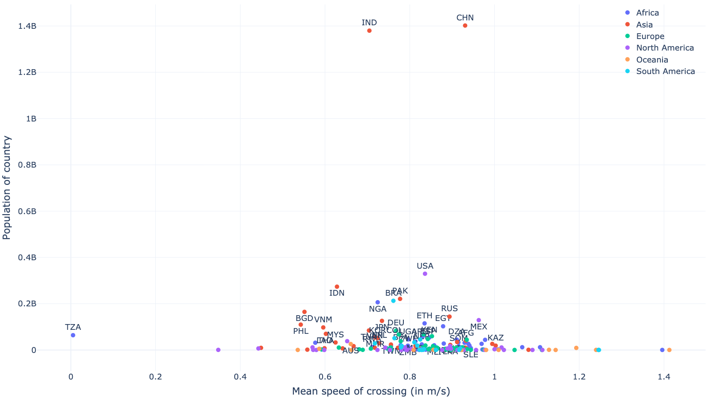](https://htmlpreview.github.io/?https://github.com/bazilinskyy/youtube-national/blob/main/figures/scatter_speed_crossing_avg-population_country.html)
Mean speed of crossing over population of country.

[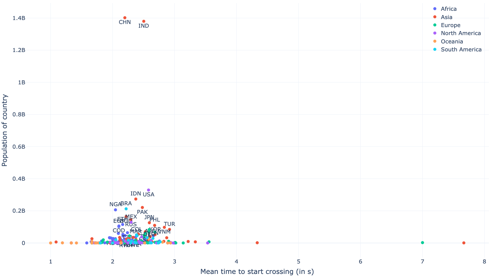](https://htmlpreview.github.io/?https://github.com/bazilinskyy/youtube-national/blob/main/figures/scatter_time_crossing_avg-population_country.html)
Mean time to start crossing over population of country.

[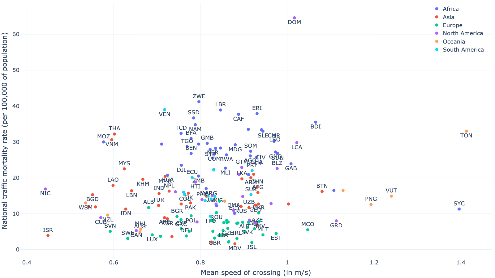](https://htmlpreview.github.io/?https://github.com/bazilinskyy/youtube-national/blob/main/figures/scatter_speed_crossing_avg-traffic_mortality.html)
Mean speed of crossing over traffic mortality.

[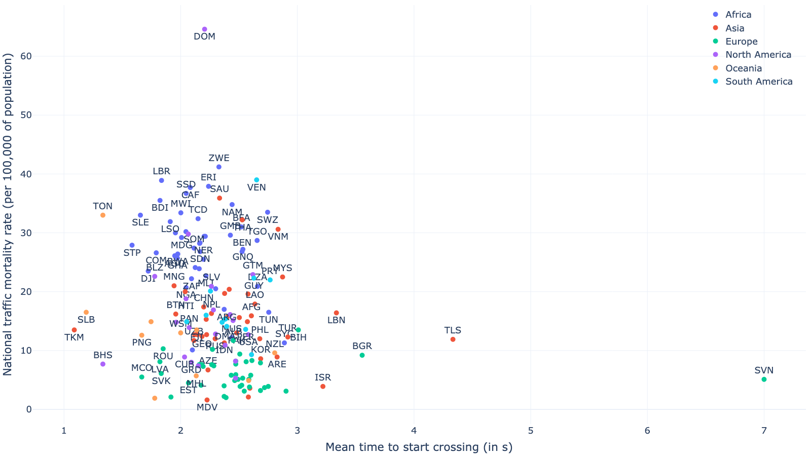](https://htmlpreview.github.io/?https://github.com/bazilinskyy/youtube-national/blob/main/figures/scatter_time_crossing_avg-traffic_mortality.html)
Mean time to start crossing over traffic mortality.

[](https://htmlpreview.github.io/?https://github.com/bazilinskyy/youtube-national/blob/main/figures/scatter_speed_crossing_avg-literacy_rate.html)
Mean speed of crossing over literacy rate.

[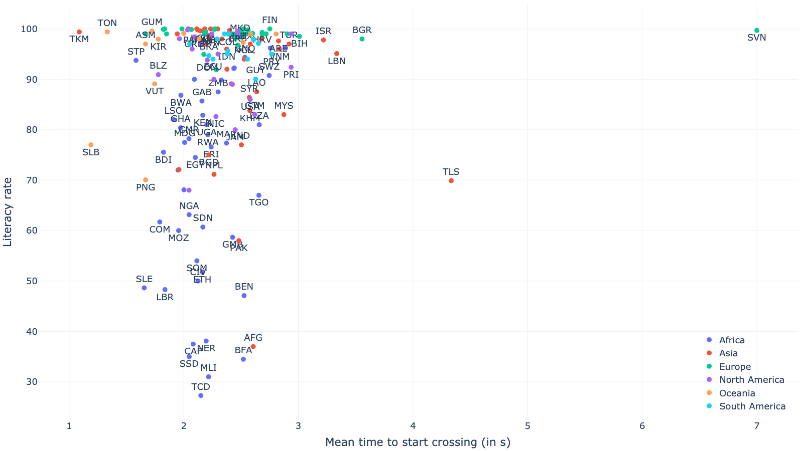](https://htmlpreview.github.io/?https://github.com/bazilinskyy/youtube-national/blob/main/figures/scatter_time_crossing_avg-literacy_rate.html)
Mean time to start crossing over literacy rate.

[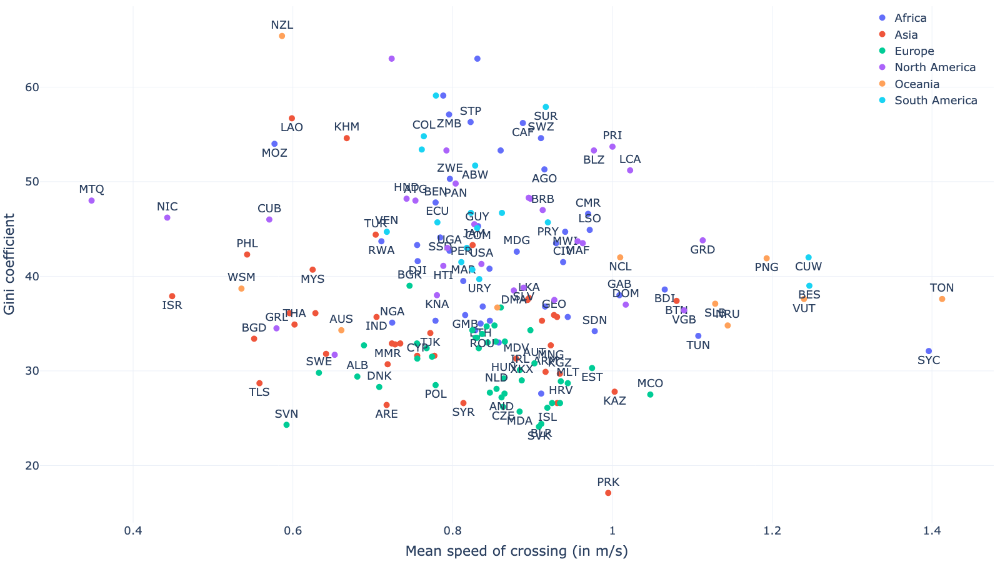](https://htmlpreview.github.io/?https://github.com/bazilinskyy/youtube-national/blob/main/figures/scatter_speed_crossing_avg-gini.html)
Mean speed of crossing over Gini coefficient.

[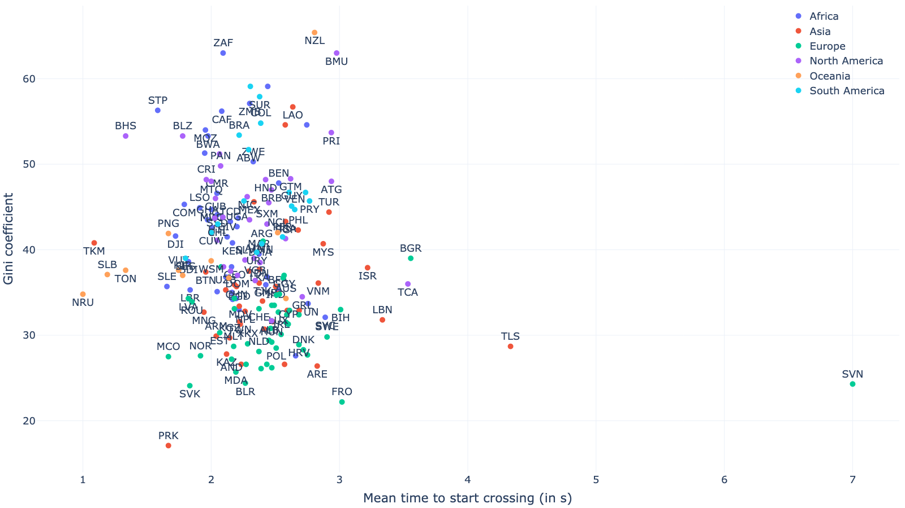](https://htmlpreview.github.io/?https://github.com/bazilinskyy/youtube-national/blob/main/figures/scatter_time_crossing_avg-gini.html)
Mean time to start crossing over Gini coefficient.

[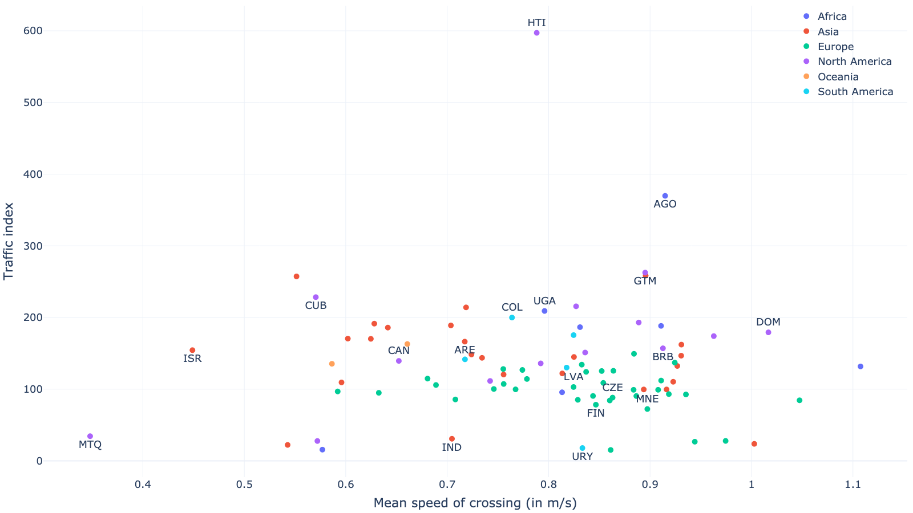](https://htmlpreview.github.io/?https://github.com/bazilinskyy/youtube-national/blob/main/figures/scatter_speed_crossing_avg-traffic_index.html)
Mean speed of crossing over traffic index.

[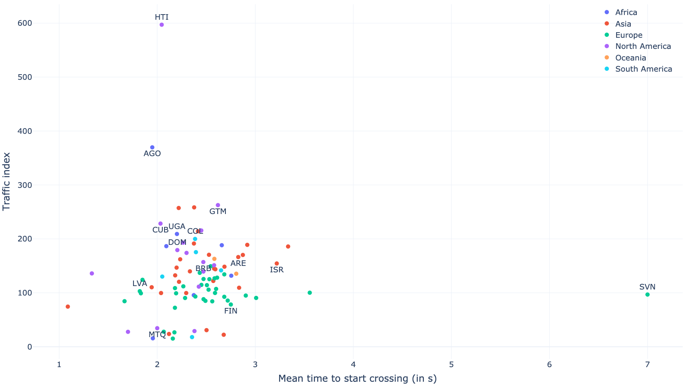](https://htmlpreview.github.io/?https://github.com/bazilinskyy/youtube-national/blob/main/figures/scatter_time_crossing_avg-traffic_index.html)
Mean time to start crossing over traffic index.

[](https://htmlpreview.github.io/?https://github.com/bazilinskyy/youtube-national/blob/main/figures/scatter_time_crossing_avg-traffic_index.html)
Mean time to start crossing over traffic index.

### Correlation matrices
[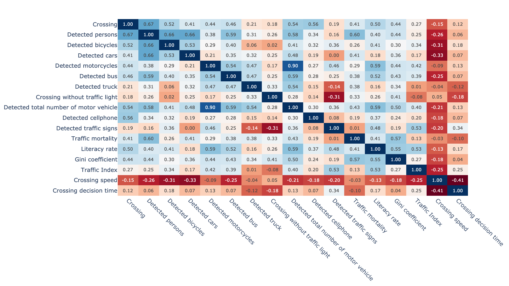](https://htmlpreview.github.io/?https://github.com/bazilinskyy/youtube-national/blob/main/figures/correlation_matrix_heatmap_averaged.html)
Correlation matrix.

[](https://htmlpreview.github.io/?https://github.com/bazilinskyy/youtube-national/blob/main/figures/correlation_matrix_heatmap_day.html)
Correlation matrix at daytime.

[](https://htmlpreview.github.io/?https://github.com/bazilinskyy/youtube-national/blob/main/figures/correlation_matrix_heatmap_night.html)
Correlation matrix at night time.

[](https://htmlpreview.github.io/?https://github.com/bazilinskyy/youtube-national/blob/main/figures/correlation_matrix_heatmap_Africa.html)
Correlation matrix for Africa.

[](https://htmlpreview.github.io/?https://github.com/bazilinskyy/youtube-national/blob/main/figures/correlation_matrix_heatmap_Asia.html)
Correlation matrix for Asia.

[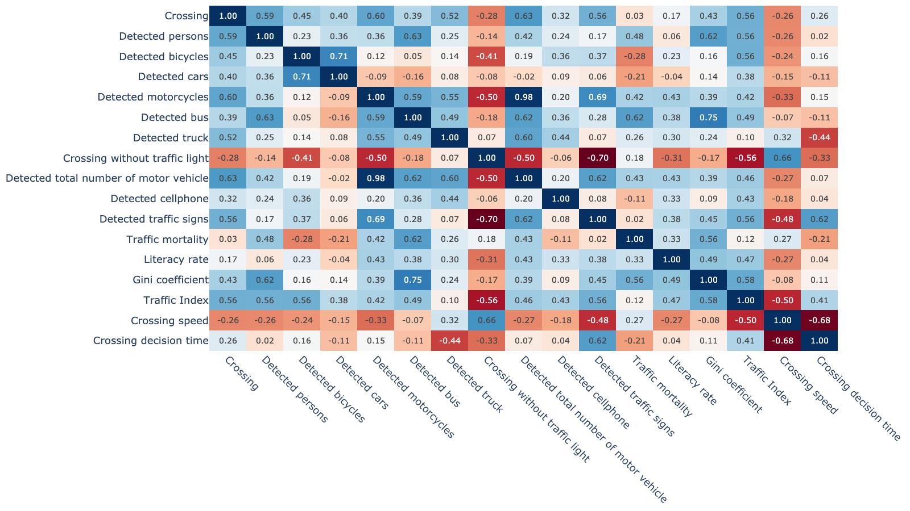](https://htmlpreview.github.io/?https://github.com/bazilinskyy/youtube-national/blob/main/figures/correlation_matrix_heatmap_Oceania.html)
Correlation matrix for Oceania.

[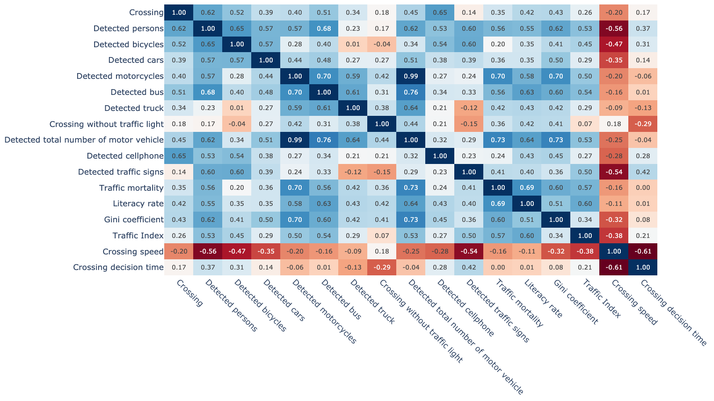](https://htmlpreview.github.io/?https://github.com/bazilinskyy/youtube-national/blob/main/figures/correlation_matrix_heatmap_Europe.html)
Correlation matrix for Europe.

[](https://htmlpreview.github.io/?https://github.com/bazilinskyy/youtube-national/blob/main/figures/correlation_matrix_heatmap_North%20America.html)
Correlation matrix for North America.

[](https://htmlpreview.github.io/?https://github.com/bazilinskyy/youtube-national/blob/main/figures/correlation_matrix_heatmap_South%20America.html)
Correlation matrix for South America.

### Analysis of pedestrian crossing road with and without traffic lights (jaywalking)
[](https://htmlpreview.github.io/?https://github.com/bazilinskyy/youtube-national/blob/main/figures/crossings_with_traffic_equipment_avg.html)
Road crossings with traffic signals (normalised over time and number of detected pedestrians).

[](https://htmlpreview.github.io/?https://github.com/bazilinskyy/youtube-national/blob/main/figures/crossings_without_traffic_equipment_avg.html)
Road crossings without traffic signals (normalised over time and number of detected pedestrians).

[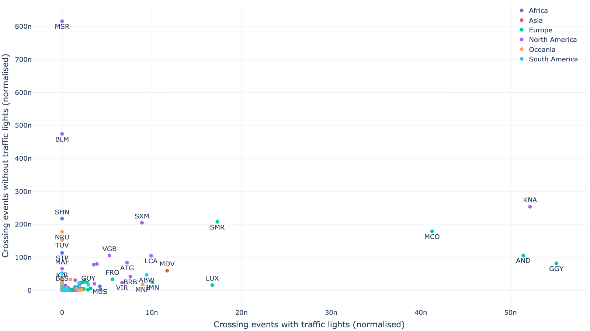](https://htmlpreview.github.io/?https://github.com/bazilinskyy/youtube-national/blob/main/figures/scatter_with_trf_light_norm-without_trf_light_norm.html)
Road crossings with and without traffic signals (normalised over time and number of detected pedestrians).

## License
This project is licensed under the MIT License - see the LICENSE file for details.

## Contact
If you have any questions or suggestions, feel free to reach out to md_shadab_alam@outlook.com
